# Table of Content
1. [Site Overview](#site-overview)
2. [Planning](#planning)
    * [Target Audiences](#target-audiences)
    * [Color Scheme](#color-scheme)
    * [Wireframes](#wireframes)
3. [Features](#features)
    * [Existing Features](#existing-features)
    * [Future Updates](#future-updates)
4. [Testing](#testing)
    * [Responsiveness](#responsiveness-testing)
    * [Validator Results](#validator-results)
    * [Functionality](#functionality-testing)
    * [User Stories](#the-user-stories)
    * [Bug Report](#bug-report)
5. [Deployment](#deployment)
6. [Credits](#credits)

# Site Overview 

User
Moxxi's market is a website/application created for the purpose of utilizing the ability to send weapons between players in the popular video game, Borderlands 3. Based largely off of a character from the game, the aim of the sites styling and choice in text is to feel very much like part of the world players love exploring. The site acts as a trading hub of sorts, where users are able to create an account and list weapons from the game by filling out the information into a form. From there, the user is able to find and remove the item from their profile page. Or check out the market and see what other people have listed. Given that I have not yet learned anything to do with payments, the site goal is to simply connect the two parties (buyer and seller) via an automated email to the seller once the buyer clicks on the "interested" button on the item card.

# Planning 

## Target Audiences:

* Current players of the game

* Older players that do not play the game anymore

* Players that are new to the game

### User Stories:

* As a player that is new to the game, I want to be able to see the latest weapons to be listed.

* As a current player I want to be able to easily let the seller of an item know that I am interested.

* As an current player, I want to be able to quickly find my weapons that I have listed and that other users are interested in.

* As a frequent user of the site, I want to be able to easily update my account details.

* As an older player, I want to be able to easily delete my account.

## Color Scheme:

The color scheme I have gone for takes alot of inspiration from the character 'Moxxi' from the borderlands franchise. I went for alot of vibrant purples and used white and dark greys to add the needed contrast to the site. The form pages (sign up, login, update details, create item) have been changed as originally I planned on making them mimic the game menus alot more. However the plan involved darker greys being the main colors with blue accenting the page, and when building my wireframes I realised looked very out of place compared to the rest of the site. So i changed the color scheme to match the rest of the site. I also planned on more pages having background images. But decided to not as I could not find what I was looking for, so stuck with white for the rest.

Below is a grind I have used to check the contrast scores so as to be sure all text remains readable throughout the site, created on hhttps://contrast-grid.eightshapes.com/ .

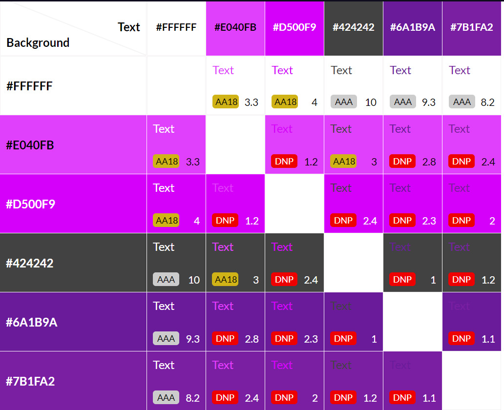

* The only color combinations used are those that pass.

## Wireframes:

Here are my wireframes that I created at the start of my project and used as the rough template for my site, for mobile, tablet and desktop viewing. 

* Landing Page
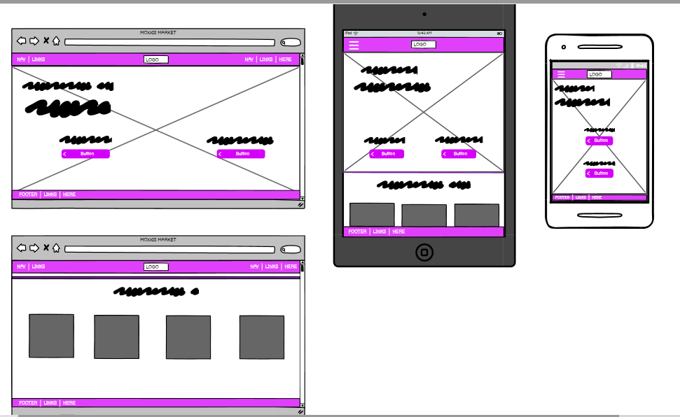

* Market page
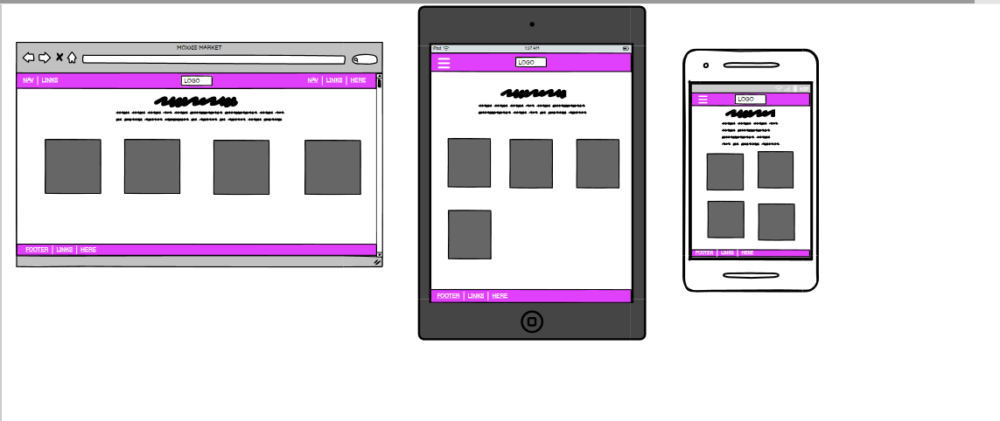

* Form pages
When building these wireframes I Knew I was going to bulid all form pages (sign up, login, update details, create item) from one another and therefore there really was no need to make a wireframe for each when the only real difference in the content is how many input fields the form has.
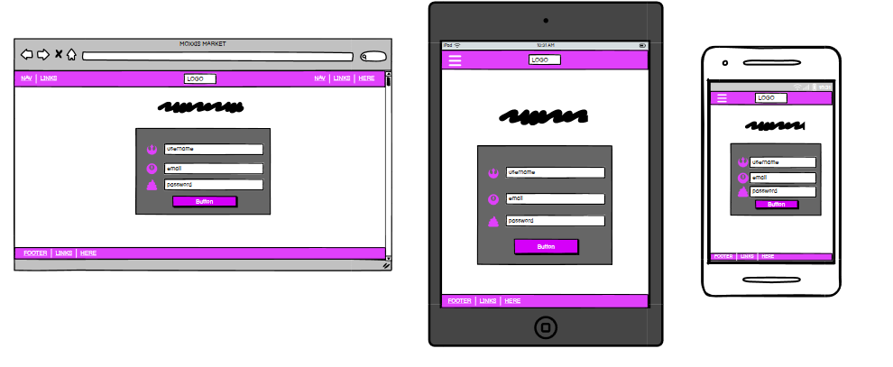

* Profile page 
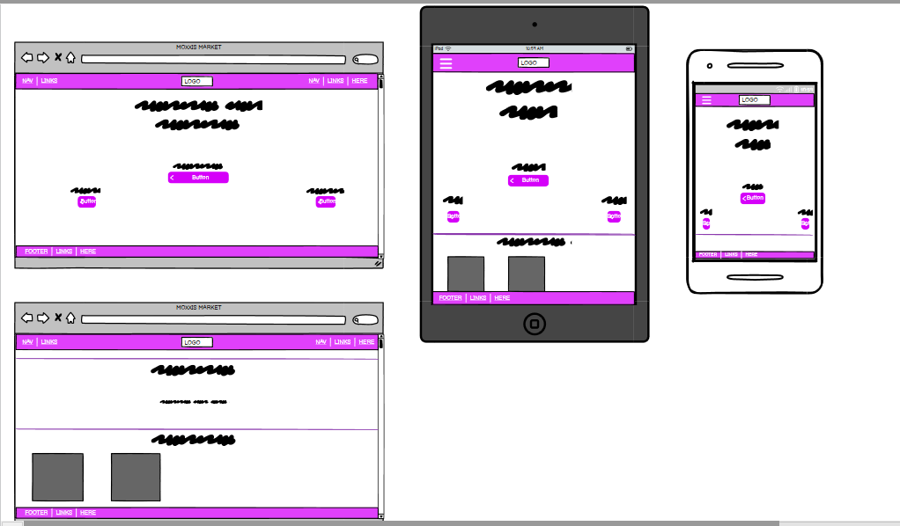

# Features

Below you will find a list of the features currently found on the site, and also a few features I am planning on adding in the future.

## Existing Features:

### Landing Page

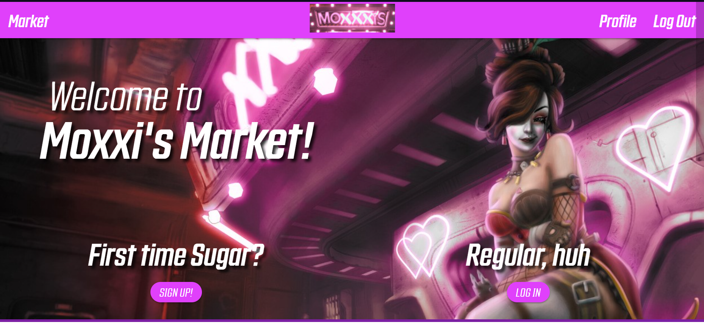

Upon entering the site, the user is greated with a Welcome message and a high res, fan made background image. Immediatley informing them of where they are and triggering a sense of familiarity with people who keep up with the franchise. From there the user can scroll down to find a section mimicing the markets functionality however It is only displaying the most recent 6 weapons to be added to the db, as implied with the header for this section.

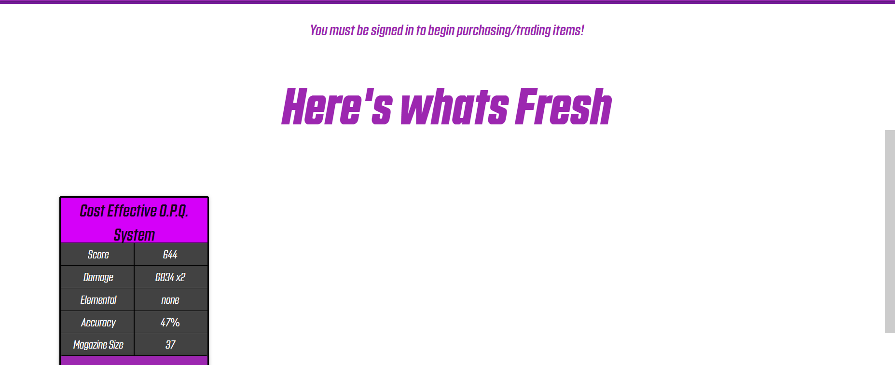

### Market

The market is the main focus of the site. Users can navigate to the market via the navbar found at the top of the page (Originally there was going to be a link with a label found on the landing page. However it made the UI messy wouldve made me have to completley redesign. So instead I relied on the familiarity with the common conventions of web development to help the user advance through the site rather than being immediatley pushed to another page as soon as a page loads). Once here the user is greated with a page header and brief description on the purpose and how to use the functionality of the site. Below this users find the item cards, The window into the database if you will. The page uses jinja2 templating to incorporate for loops directly within the html content and uses this functionality to load as many item cards as is required and populate them with the correct data.

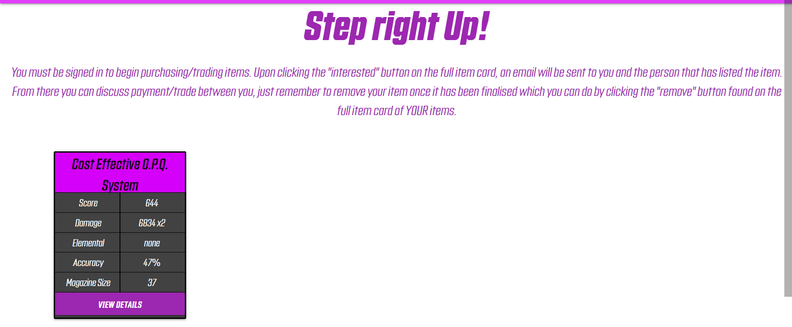

I will also cover the item cards functionality in this section. When clicking on "view details" A modal is displayed to the user with the full data for the weapon (limited amount of room on page caused me to "minify" item card found on page load). If the user was not the one to list the item then they are greeted with a green 'interested' button at the bottom of the modal that will initiate an email being sent to the seller aswell as moving the item to the 'pending_items' db so as to avoid 20 people all fighting over the same item. If you are the seller, you will find that button is red and reads 'remove' and is used to delete the item from wherever it is. And if the seller looks at an item in the pending db, they will also find a blue button to 're list' the item and put it back in the main db.

### Flash messsages

The site makes use of flasks flash messages and uses them regularly to provide the user with feedback on their actions or to warn the user of an error.

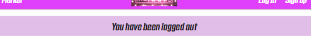

### Profile page 

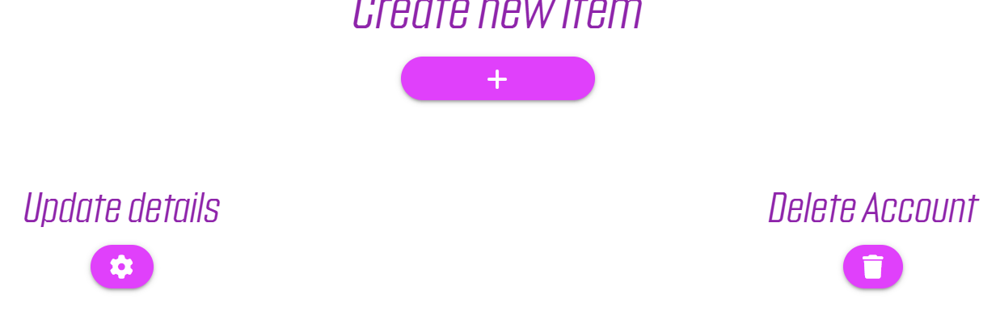

The site allows for full account fuctionality. The user has a login and a sign up page to create and access an account. On the profile page they can then see their details, access a page to update all of their details, and a page to create/ list a new item. Also found on the profile page is two section mimicing the market page. One to display the users listed items and the other to display the users items in the 'pending' db.

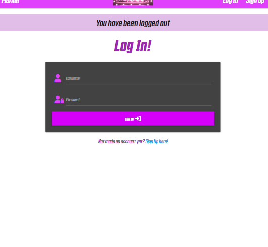

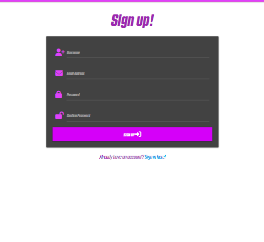

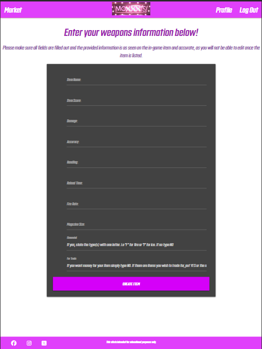

### Nav bar

The site features a fully responive fixed navbar, that converts to a side-nav at the apporpriate screen sizes. Foubd on the nav bar is also the sites logo that acts as a short cut back to the home/landing page.

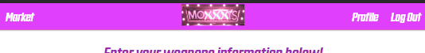

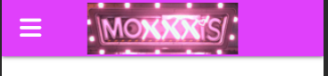

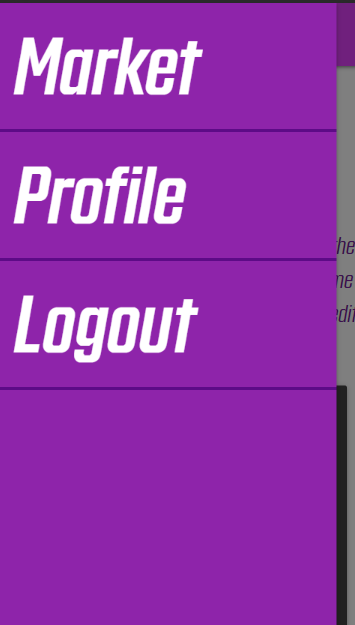

### Footer

The site also has a small footer, fixed to the bottom of the page that contains a small disclaimer and social links that will just take the user straight to the home pages for the socials.

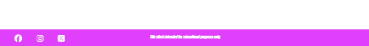

## Future Updates

The only thing I planned to do but ran out of time to implement and hope to go back and add in future is adding a weapon type category in the form of a dropdown menu on the create item form. Assiging the item a certain weapon type would then attach a weapon specific image to the card. However contraints with knowledge and time prevented me from doing this.

# Testing

## Responsiveness Testing:

I began testing the responsiveness of the site firstly by switching through different device screen sizes using developer tools on google chrome on each page and using every feature at each main breakpoint. Below you will find a screenshot of the full list of the device screen sizes used.

* List of device screen-sizes used in dev tools:

### I have tried to test the website on as many devices as I can, however, I don't have access to many. here I will include a list of all the devices that I have been to use to test the site:
* ASUS Zenbook Duo 14 ^
* Samsung S20 ultra ^
* Samsung A51
* IPhone 14
* IPhone 12
* IPad Air (4th gen) ^

### Here is a list of the different browsers I have tested the website on and found no obvious faults:
* Opera/Opera GX
* Google Chrome
* Microsoft Edge
* Mozilla Firefox
* Samsung Internet (Android)
* Safari 

## Validator results

### HTML Validator

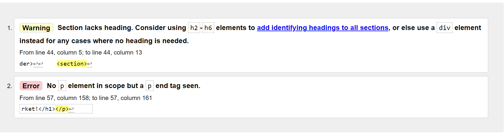

The only two errors encountered where these.
* The first error is due to the section containing flash messages not having a header. Given the nature of the flash messages and the fact that styling had already been done on the p element found there I decided to leave it as is.

* The second error is caused by a trailing closing p tag left in error when changing the title/header of 'main.html' from a p to a h1 element. As this was such an easy fix and there where only two errors I have just used my first screenshot of the validator.

### CSS Validator Results:

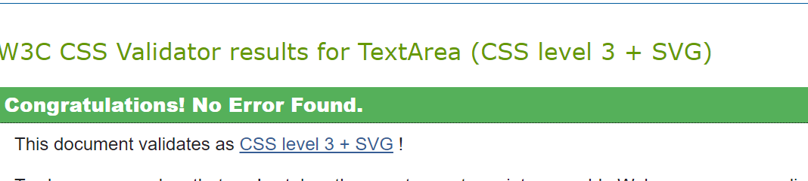

## Functionality Testing:

* I started with testing the navbar across the site going to and from pages and then filling out and submitting the forms and checking that the correct changes occured and encountered no errors.

* All html elements where tested and checked using the live server. 

* I created mulitple accounts and used them to test the CRUD functionality multiple times and encountered no obvious errors.
    * I decided not to give users the ability to update the item after listing as givin it relies on honesty more than anything. i did not want a user to be able to list a very rare item, agree to sell for a high price and then once payment is sent changes the item to something of significanty less value and then send that.

## Designing the db

Given the fact each weapon has an identical set of information with varying values. I kept the db nice and simplistic. Having two dbs for items (one to store the items for sale, the other to store pending items before re listing or deletion from the db) and another to contain the user info for the account functionality. I decided to use mongoDB as I had an easier time setting it up and understanding the UI aswell as feeling more comfortable and confident using data in a JSON format.

### The Data Schema: 

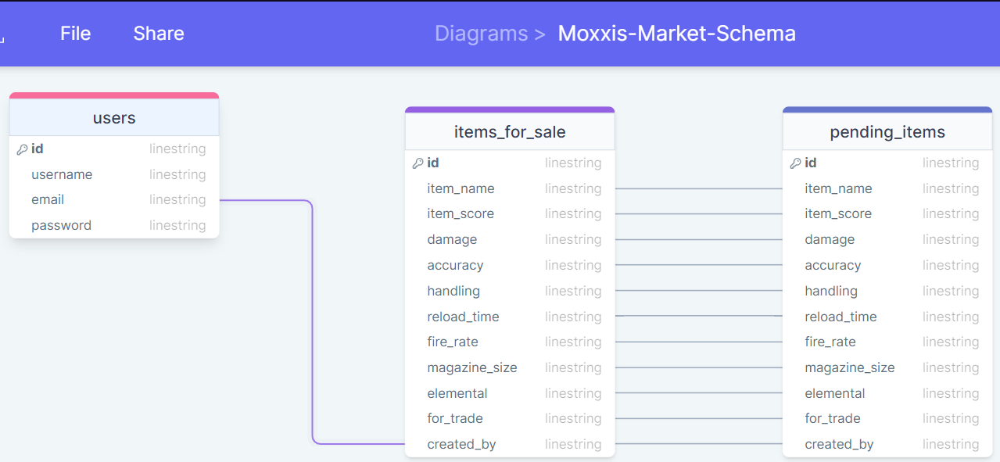

Before creating any item data, The user must first create an account and by extension create data for the 'users' db. All input fields are required including Email. Which, once an account has been created, is how the users item data is linked to their account. When you create the item, python builds the data from the forms inputs and adds one more key value pair. The key being 'created_by' and the value, pulling the users email from the 'users' db. When moving an item to and from the 'pending' db, python takes all the items values (not including the id) and uses it to build a completley new item in the other db, and deleting the existing item from the db it is stored in.

Due to the way Python Builds the data from form inputs. And that changing the data type is not required anywhere for this project. All data within the db is in string format 

## The User Stories:

* As a player that is new to the game, I want to be able to see the latest weapons to be listed.
    * Upon landing on the page, the user can scroll down and see the last 6 items to be listed on the site.

* As a current player I want to be able to easily let the seller of an item know that I am interested.
    * When viewing the full item card, Clicking the interested button will alert the seller that you are interested in their item via email.

* As an current player, I want to be able to quickly find my weapons that I have listed and that other users are interested in.
    * Navigate to your profile page and scroll down to find a section that displays all the users items currently in the 'pending' db.

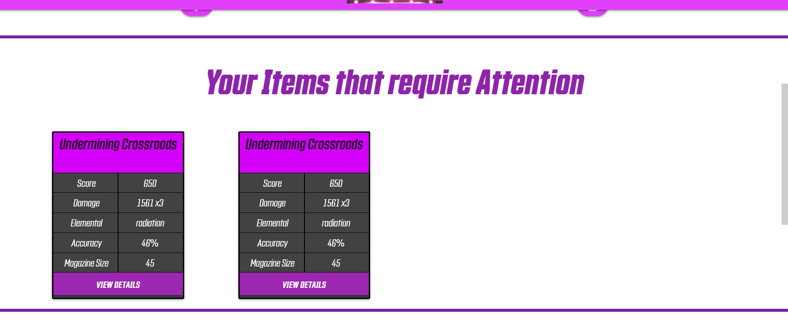

* As a frequent user of the site, I want to be able to easily update my account details and As an older player, I want to be able to easily delete my account.
    * Navigate to the profile page and the user is immediatley greeted with a series of buttons with labels displaying there use.

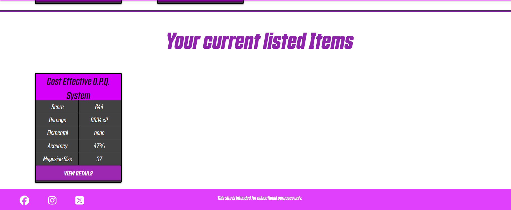

## Bug Report:

Towards the end of development I realised I had forgotten to add any way of preventing somone that is not logged in from clicking the "interested button" As the site relise on using the users emails to get them in contact with one another, and furthermore the code would throw an error if there was not an email where it was required. However any measure I've taken, either to have code that will catch the user before the main block is executed and redirect them back to the market page with a flash message, or to just remove the button all together if the user is not logged in have not worked. I am very confused as I have used similar checks throughout my code and they have worked correctly up until now. I unfortunaltey caught this too late to have the time to fix. However will be looking into it further after project submission.

# Deployment

* The site was deployed to Heroku. The steps to deploy are as follows:
    * From the overview page, navigate to deploy
    * Scroll right down to the bottom of the page until you see a purple 'deploy' button
    * Click this button and wait for Heroku to build the app
    * Assuming the build encounters no errors, You will see a 'view app' button both at the top and bottom of the page
    * Click this button and the browser will navigate to the deployed app.

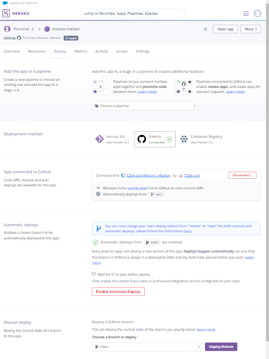
The live link can be found here - https://moxxis-market-9a43344671ad.herokuapp.com

# Credits

* Many Elements of the site, Including the navbar, forms and much of the account functionality was taken from my previous code along task master project.

* I used materealize almost exlusivley for the styling. Using the pre set colors aswell as making use of the grid system provided by the framework.

* The background Image was created by ARTHIZAN and was found on https://www.artstation.com/?sort_by=community&dimension=all

### And as always a huge thank you to my mentor rich, who is constantly going above and beyond helping me with problems with the code, guidance and support aswell as always finding the time to have a chat. And also to my friend Barnaby, who was always there to help me troubleshoot, explain things and to bounce ideas off. 
